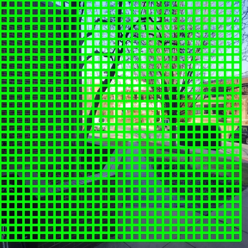
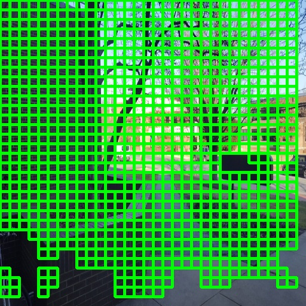
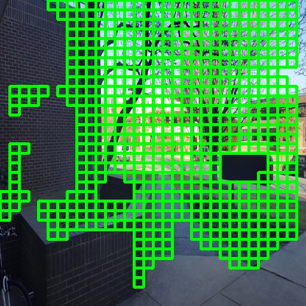
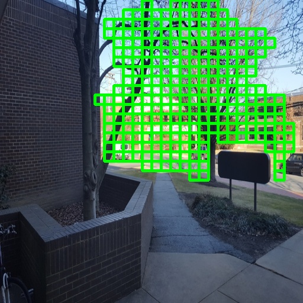

# ConvSequential-SLAM

This repository provides the official implementation of ConvSequential-SLAM, introduced in the following paper:  

**Title:** ConvSequential-SLAM: A Sequence-Based, Training-Less Visual Place Recognition Technique for Changing Environments  
**Authors:** Mihnea-Alexandru Tomita, Mubariz Zaffar, Michael J. Milford, Klaus D. McDonald-Maier and Shoaib Ehsan

Published in IEEE Access, vol. 9, pp. 118673-118683, 2021 and available 📑 [here](https://doi.org/10.1109/ACCESS.2021.3107778).

## 📖 Overview

Visual Place Recognition (VPR) is the task of recognizing previously visited locations despite changes in viewpoint and appearance. Existing handcrafted methods often fail under strong appearance variations, while deep-learning approaches require heavy computation and extensive training.

**ConvSequential-SLAM** is a sequence-based, training-less VPR technique that achieves state-of-the-art performance under viewpoint and appearance variations. The method leverages:
- **Convolutional matching** to improve robustness to moderate viewpoint variations.
- **Regional, block-normalized HOG descriptors** to achieve conditional invariance without relying on contrast-enhanced pixel matching.
- **Information-gain analysis from consecutive query images** to determine the minimum sequence length needed, tailored specifically for ConvSequential-SLAM.
- **Entropy-based salient region extraction** to dynamically adjust the sequence length based on the environment, rather than using a fixed length as in traditional sequence-based VPR techniques.

> Note: This repository also provides a version of ConvSequential-SLAM that uses a static (fixed) sequence length in addition to the dynamic sequence length version described above. We discuss how to run both versions in more detail in the *Running ConvSequential-SLAM* section of this repo.

## ⚙️ Installation / Setup

**ConvSequential-SLAM** is implemented in *Python 2.7* and requires the following libraries to run:
`cv2`, `numpy`, `scikit-image`, `matplotlib`, `numba` and `scipy`.

### Installing Dependencies 
Install the required Python packages with:  
`pip2 install numpy opencv-python scikit-image matplotlib numba scipy`

 **Note:** Make sure you are using Python 2.7. Check your version with `python2 --version`
 
## 🚀 Running ConvSequential-SLAM
This repository provides two versions of ConvSequential-SLAM:
1. `ConvSequential-SLAM.py` dynamically adapts the sequence length based on the environment.
2. `ConvSequential-SLAM_static_k.py` uses a fixed sequence length `k`, specified by the user.  

Both versions are ready to run out-of-the-box with the provided folder structure.

### ✏️ Required User Modifications
Update these values to match your dataset paths and number of images:  
<pre>
total_Query_Images = 100  # Number of query images in your dataset
total_Ref_Images = 100    # Number of reference images in your dataset

# Update these paths to point to your dataset
query_directory = '/home/mihnea/datasets/campus_loop_original/live/'
ref_directory = '/home/mihnea/datasets/campus_loop_original/memory/'

# Directory for visualizing entropy-based regions extraction
out_directory = '/home/mihnea/ConvSequential-SLAM/entropy_extracted_regions/'  
</pre>

### Running the Dynamic Version
Open a terminal in the `ConvSequential-SLAM/` folder then execute the main script using the following command: 
`python2 ConvSequential-SLAM.py`

**Default parameters used in our experiments:**
<pre>
W1 = H1 = 512
W2 = H2 = 16      # HOG cell-size
L = 8             # HOG bin size
ET = 0.5          # Entropy threshold (0-1)
IT = 0.9          # Overlapping threshold (0-1)
min_k = 1
max_k_IG = 15     # Corresponds to max_overlap in the code
max_k = 25
</pre>

> These values form the backbone of the system and are responsible for computing the optimal dynamic sequence length. To reproduce the results presented in the paper, these parameters should remain unchanged. For more information, please visit the paper.

### Running the Static Version 
Open a terminal in the `ConvSequential-SLAM/` folder then execute the main script using the following command:  
`python2 ConvSequential-SLAM_static_k.py`

**Important:** In addition to the changes specified in the *Required User Modifications* section, this version of ConvSequential-SLAM requires the sequence length `k` to be specified.

## 🖼 Region-of-Interest (ROI) Extraction

ConvSequential-SLAM extracts salient regions depending on the entropy threshold (*ET*). Increasing *ET* filters out non-informative elements such as walls and floors, reducing the number of detected ROIs per image as illustrated below:

<table>
  <tr>
    <td>
       
      
Query Image

    </td>
    <td>
       
      
ET = 0.4

    </td>
    <td>
       
      
ET = 0.5

    </td>
  </tr>
  <tr>
    <td>
       
      
ET = 0.6

    </td>
    <td>
       
      
ET = 0.7

    </td>
    <td>
       
      
ET = 0.8

    </td>
  </tr>
</table>

## 📊 Example Output
After running ConvSequential-SLAM, the results are saved in `Results_ConvSequential-SLAM.csv`. The below table shows the first 6 entries as an example; the full CSV contains the data for the entire dataset.

<table>
  <tr>
    <th>Query Index</th>
    <th>Matched Reference</th>
    <th>Similarity Score</th>
    <th>Sequence Length K</th>
    <th>Sequence Entropy</th>
  </tr>
  <tr><td>0</td><td>0</td><td>0.9088</td><td>15</td><td>0.5984</td></tr>
  <tr><td>1</td><td>1</td><td>0.9089</td><td>15</td><td>0.5959</td></tr>
  <tr><td>2</td><td>2</td><td>0.8985</td><td>2</td><td>0.5839</td></tr>
  <tr><td>3</td><td>3</td><td>0.8949</td><td>2</td><td>0.5472</td></tr>
  <tr><td>4</td><td>4</td><td>0.9071</td><td>6</td><td>0.5712</td></tr>
  <tr><td>5</td><td>5</td><td>0.8899</td><td>3</td><td>0.5737</td></tr>
</table>

> Each row corresponds to a query image, indicating the best-matched reference image, the similarity score between the query/reference pair, the sequence length assigned by the system, and the entropy of that sequence.

### ⚠️ Just a Heads-Up

One last thing: this was my first big project as part of my PhD. The code might not be the prettiest or the easiest to follow, but I’ve tried to include helpful comments throughout to make it easier to understand. That said, it works as intended, and I hope it’s useful if you want to explore or experiment with ConvSequential-SLAM.

## 📄 Citation

If you found this repository helpful, please cite the paper below:
<pre>
@ARTICLE{9521896,
  author={Tomiṭă, Mihnea-Alexandru and Zaffar, Mubariz and Milford, Michael J. and McDonald-Maier, Klaus D. and Ehsan, Shoaib},
  journal={IEEE Access}, 
  title={ConvSequential-SLAM: A Sequence-Based, Training-Less Visual Place Recognition Technique for Changing Environments}, 
  year={2021},
  volume={9},
  number={},
  pages={118673-118683},
  keywords={Feature extraction;Visualization;Entropy;Training;Simultaneous localization and mapping;Mathematical model;Image recognition;SLAM;sequence-based filtering;visual localization;visual place recognition},
  doi={10.1109/ACCESS.2021.3107778}}
 </pre>

